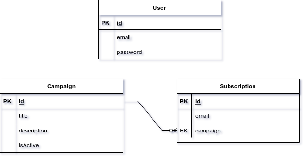

# Subsify

## Prerequisites

Before you begin, ensure you have met the following requirements:

- Node.js and npm (Node Package Manager) or Yarn installed on your machine.

## Installation

1. Open your MongoDB management tool or use the command-line interface to create a new database named `subsify`
2. Duplicate the `.env.example` file and save it as `.env` in the root directory of your project. You can do this manually by creating a new file named .env and copying the contents of `.env.example` into it.
3. Clone this repository to your local machine and change your working directory to the project folder.
4. Install project dependencies using npm or Yarn.
   - Yarn: `yarn install`
   - NPM: `npm install`

## Usage

### Development

To run the project in development mode with auto-reloading on code changes, use the following command:

- Yarn: `yarn dev`
- NPM: `npm run dev`

### Production

To build the project for production, use the following command:

- Yarn: `yarn build`
- NPM: `npm run build`

### Production

To build the project for production, use the following command:

- Yarn: `yarn build`
- NPM: `npm run build`

### Start

To start the project in production mode after building, use:

- Yarn: `yarn start`
- NPM: `npm start`

### Testing

To run tests with Jest, use the following command:

- Yarn: `yarn test`
- NPM: `npm test`

## Database Diagram

